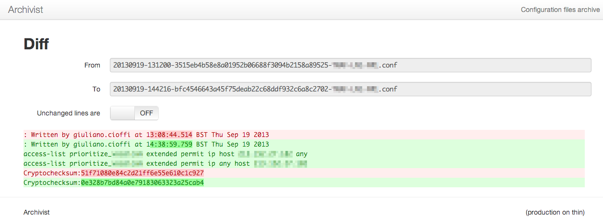

# Archivist

Archivist watches for files being written to `:incoming_path`. As soon as
one appears, Archivist will move it to `:archive_path`, adding a timestamp
and a SHA1 sum to the file name.

A simple web app lets you browse the archive and display the differences
between file revisions.

I use this mainly with network devices (routers, firewalls),
issuing the equivalent of a `write net` command whenever I want some config
changes to be captured. In this setup, Archivist is monitoring the "home"
directory of a TFTP/FTP server.

## Screenshots

